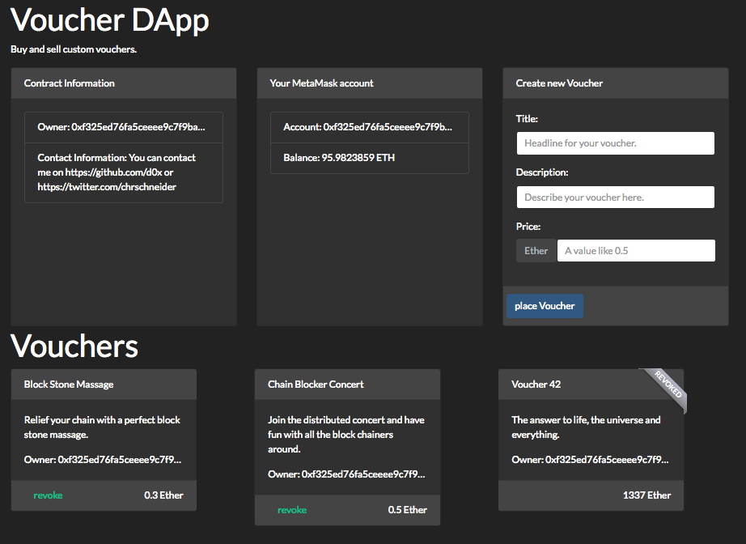

# Voucherchain

> My contribution for the final project of the Consensys Developer Program 2018.

## Local development setup

Prerequisites:
* ganache-cli is running on port 7545
* A browser with MetaMask is configured with your ganache-cli
* truffle is installed

Get in running:

``` bash
# get the source
git clone https://github.com/d0x/voucherchain

# go into the project directory
cd voucherchain

# migrate the contracts to ganache
truffle migrate

# (optional) check the solidity tests
truffle test

# install all frontend dependencies
npm install

# serve a local fronted on http://localhost:8080
npm start
```

Now you can direct your browser to http://localhost:8080 and you will see this page:



This dapp can do the following things:
* As Seller, I want to create vourches.
* As Seller, I want to revoke my vourchers, so that nobody can buy them.
* As Buyer, I want to buy available vourches for the given price.
* As User, I want to have sold and revoked vourchers flagged, so that I can act properly.  
* As User, I want to see my MetaMask Account Address and Balance. (Demonstrates OpenZeppelin EthPM usage)
* As User, I want to see some Contact Information comming from the blockchain. (Demonstrates OpenZeppelin EthPM usage)
* As Course Student Auditor, I want to have 3 example vourchers, so something is visible from the beginning.

A few things to try or see:
* Wether you see "revoke" or "buy" buttons in the vourcher-footers dependes on the account you are using.
  * You can only revoke your vouchers.
  * You can only buy other vouchers.
* Changes to your MetaMask account and balance are reflected within the "Your MetaMask account" card.
* Placing/buying/revoking a vourcher is immediately updated within the UI using solidity events. 
